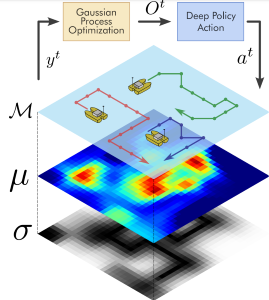

## A Deep Reinforcement Learning framework for Multi-agent Environmental Information Gathering with Local Gaussian Processes for Water Monitoring

{width=150 height=150}

Abstract

The conservation of hydrological resources involves continuously monitoring their contamination. A multi-agent system composed of autonomous surface vehicles is proposed to efficiently monitor the water quality, including pollution indicators and detection of algae dangerous to humans. To achieve an optimal and safe control of the fleet, the fleet policy should be able to react efficiently based on online measurements and be aware of the fleet state. In this paper, it is proposed to jointly use Local Gaussian Processes and Deep Reinforcement Learning to obtain scalable and effective monitoring policies. Local Gaussian processes, unlike classical global Gaussian processes, can accurately represent processes of interest with GP parameters adapting to different spatial regions of the monitored domain. With respect to policies, a deep convolutional policy is proposed, that bases the decisions on the observation on the mean and variance of local Gaussian processes, by means of the maximization of a tailored reward function related to the information gain. Using a Double Deep Q-Learning algorithm, agents are trained to maximize this reward surrogated to the estimation error, and by means of a Consensus-based heuristic, the collision avoidance is achieved deterministically without any need of learning. Simulation results indicate an improvement of up to 24% in terms of the root mean squared error with the proposed  models. Also, training results with 1-3 agents indicate that our proposed approach returns 20% and 24% smaller average estimation errors for, respectively, monitoring water quality variables and monitoring algae blooms, as compared to state-of-the-art approaches.

## Requirements and Installation
You need to install Pytorch with CUDA support. The code has been tested with Pytorch 1.4.0 and CUDA 10.1. You can install the requirements with the following command:
```
pip install -r requirements.txt
```

## Usage

### Ground Truths

The ground truths can be simulated executing the Algae Bloom benchmark (`Environment/GroundTruthsModel\AlgaeBloomGroundTruth.py`) and the Shekel benchmark script (`Environment/GroundTruthsModel\ShekelGroundTruth.py`)

### Environment

The full environment follows a Gymnasium structure. It is located in (`Environment/InformationGatheringEnvironment.py`)

### Training
To train a network with the environment, you can execute the following command:
```
python Training/TrainLocalDQL.py --N 3 --R changes_mu --GT algae_bloom --GPU 0
```
The parameters are:
- `--N`: Number of agents
- `--R`: Reward function. It can be `changes_mu` or `changes_sigma`
- `--GT`: Ground truth. It can be `algae_bloom` or `shekel`
- `--GPU`: GPU to use

### Testing
To test a network with the environment, you can execute the following command:
```
Evaluation/EvalDQL.py
```

Be sure to change the parameters in the script to match the ones used in training. Do the same for the path to the model.
